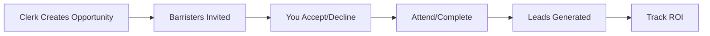

Opportunities are business development activities organised by chambers that can lead to new client relationships and instructions. Unlike leads (which are immediate client enquiries), opportunities represent potential future work from networking, publishing, or speaking engagements.

## Types of Opportunities

<CardGroup cols={2}>
  <Card title="Events" icon="calendar-days">
    Conferences, seminars, and networking events
  </Card>
  <Card title="Articles & Publications" icon="newspaper">
    Writing for legal journals, newsletters, or client alerts
  </Card>
  <Card title="Presentations" icon="presentation-screen">
    Speaking engagements, CPD sessions, or training
  </Card>
  <Card title="Client Meetings" icon="handshake">
    Introductory meetings with prospects or intermediaries
  </Card>
</CardGroup>

### Real Examples

| Type | Example | Typical Outcome |
|------|---------|-----------------|
| **Event** | Property Law Conference 2026 at Inner Temple | Meet 5-10 potential instructing solicitors |
| **Article** | "Recent Developments in Commercial Rent Disputes" for Chambers UK | Position as expert, attract enquiries |
| **Presentation** | CPD session for regional law firm on employment tribunals | Build relationship, receive 2-3 referrals |
| **Meeting** | Introduction lunch with new GC at FTSE 250 company | Establish direct instruction channel |

## How Opportunities Work

1. **Clerk creates** an opportunity with date, venue, and target audience
2. **You receive** an invitation in your dashboard
3. **You accept** to confirm participation (or decline with a note)
4. **After the event**, any enquiries are logged as leads linked to the opportunity
5. **Management tracks** which opportunities generate the best ROI

## Your Opportunity Dashboard

When viewing opportunities, you'll see:

<Frame caption="Opportunities List">
  
</Frame>

## Why Participate?

| Benefit | How It Works |
|---------|--------------|
| **Build your profile** | Articles and speaking establish you as a subject matter expert |
| **Develop client relationships** | Events create face-to-face connections with instructing solicitors |
| **Generate leads** | Opportunities often result in direct enquiries tracked back to your participation |
| **Improve engagement score** | Active participation increases your quarterly engagement rating |
| **Support chambers** | Collective BD efforts benefit everyone's practices |

## Opportunity to Lead Connection

When an opportunity generates an enquiry, the resulting lead shows its source with a **"From: [Opportunity Title]"** badge. This linking allows chambers to measure:
- Which opportunity types generate the most leads
- Individual barrister ROI from BD activities
- Overall conversion rates from events to instructions

## Your Participation History

View all opportunities you've participated in from your profile:

- **Accepted** - Confirmed participation
- **Completed** - Activity finished
- **Leads Generated** - Enquiries attributed to your participation
- **Instructed** - Leads that converted to actual work

<Tip>
Your opportunity participation contributes to your [engagement score](/barrister/engagement-score). Active barristers typically score higher.
</Tip>

## Related Guides

<CardGroup cols={2}>
  <Card title="Participating in Opportunities" icon="arrow-right" href="/barrister/participating-opportunities">
    How to accept and manage opportunities
  </Card>
  <Card title="Engagement Score" icon="arrow-right" href="/barrister/engagement-score">
    How participation affects your score
  </Card>
</CardGroup>
