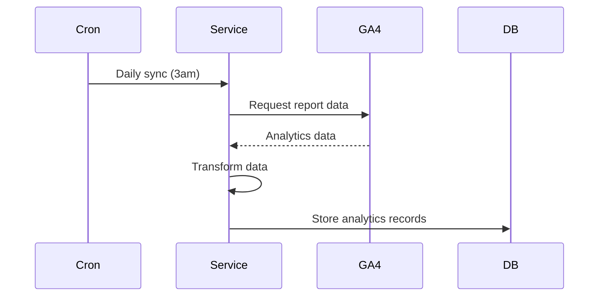

# Google Analytics Integration

The Chambers Platform integrates with Google Analytics 4 (GA4) to track website analytics and marketing attribution.

## Overview

The Google Analytics integration provides:

- **Traffic Analytics** - Website visitor tracking
- **Conversion Tracking** - Lead source attribution
- **Marketing Insights** - Campaign effectiveness
- **User Behavior** - Page views and engagement

## Authentication

### Service Account

GA4 uses a service account for server-side API access:

```bash
GA_PROPERTY_ID=properties/123456789
GOOGLE_APPLICATION_CREDENTIALS=/path/to/credentials.json
```

### Setup

<Steps>
  <Step title="Create Service Account">
    Create a service account in Google Cloud Console
  </Step>
  <Step title="Grant Access">
    Grant "Viewer" access to GA4 property
  </Step>
  <Step title="Download Credentials">
    Download JSON credentials file
  </Step>
  <Step title="Configure Environment">
    Configure environment variables
  </Step>
</Steps>

## Data Synchronization

### Sync Process



### Synced Data

| Data Type | Metrics | Dimensions |
|-----------|---------|------------|
| Traffic | Sessions, Users | Source, Medium, Campaign |
| Pages | Page views, Time on page | Page path |
| Conversions | Goal completions | Source, Page |
| Geography | Sessions | Country, City |

### Sync Frequency

| Sync Type | Frequency |
|-----------|-----------|
| Daily summary | Daily at 3am |
| Real-time | Not synced (use GA4 directly) |

## Website Attribution

### Lead Source Tracking

When leads are created from website forms:

1. GA4 captures traffic source (UTM parameters)
2. Form submission includes GA client ID
3. Platform links lead to traffic source
4. Attribution reports show lead origins

### UTM Parameters

Track marketing campaigns:

| Parameter | Purpose | Example |
|-----------|---------|---------|
| utm_source | Traffic source | google, linkedin |
| utm_medium | Marketing medium | cpc, email |
| utm_campaign | Campaign name | spring_promo |
| utm_content | Ad variation | banner_a |

## API Endpoints

### GET /api/analytics/traffic-sources

Get traffic source breakdown.

**Query Parameters:**

| Parameter | Type | Description |
|-----------|------|-------------|
| startDate | Date | Period start |
| endDate | Date | Period end |

**Response:**
```json
{
  "data": [
    {
      "source": "google",
      "medium": "organic",
      "sessions": 1250,
      "users": 980,
      "conversionRate": 2.4
    }
  ]
}
```

### GET /api/analytics/conversions

Get conversion data.

**Response:**
```json
{
  "data": {
    "totalConversions": 45,
    "conversionRate": 2.1,
    "bySource": [
      { "source": "referral", "conversions": 20 },
      { "source": "organic", "conversions": 15 },
      { "source": "direct", "conversions": 10 }
    ]
  }
}
```

### POST /api/analytics/sync

Trigger manual analytics sync.

**Response:**
```json
{
  "success": true,
  "recordsSynced": 150,
  "period": {
    "start": "2024-01-01",
    "end": "2024-01-15"
  }
}
```

## Reports

### Available Reports

**Traffic Overview**
- Total sessions and users
- Traffic source breakdown
- Geographic distribution

**Conversion Analysis**
- Lead creation by source
- Campaign effectiveness
- Landing page performance

**Top Barristers**
- Barristers with website traffic attribution
- Profile page views
- Bio engagement

## Configuration

### Environment Variables

```bash
GA_PROPERTY_ID=properties/123456789
GOOGLE_APPLICATION_CREDENTIALS=/path/to/service-account.json
```

### GA4 Configuration

In Google Analytics:

1. Create a custom dimension for "Client ID" (to link with leads)
2. Set up conversion events for form submissions
3. Enable enhanced measurement

## Error Handling

### Common Errors

| Error | Cause | Solution |
|-------|-------|----------|
| `401` | Invalid credentials | Check service account |
| `403` | No access | Grant Viewer access to property |
| `400` | Invalid property | Verify GA_PROPERTY_ID |
| `429` | Quota exceeded | Wait or request increase |

### Rate Limits

| Limit | Value |
|-------|-------|
| Daily requests | 50,000 |
| Per second | 10 |

## Troubleshooting

### No Data Syncing

1. Verify GA_PROPERTY_ID is correct
2. Check service account has access
3. Verify credentials file path
4. Check GA4 has data for the period

### Attribution Not Working

1. Verify client ID is captured on forms
2. Check GA4 tracking code is installed
3. Verify conversion events are configured

### Data Discrepancies

1. GA4 data may have 24-48 hour delay
2. Sampling may affect large datasets
3. Compare same date ranges
4. Check timezone settings

## Security

- **Service Account**: Minimal permissions (Viewer only)
- **Credentials**: Never commit to source code
- **Data Storage**: Only aggregate data stored
- **PII**: No personal data synced from GA4
