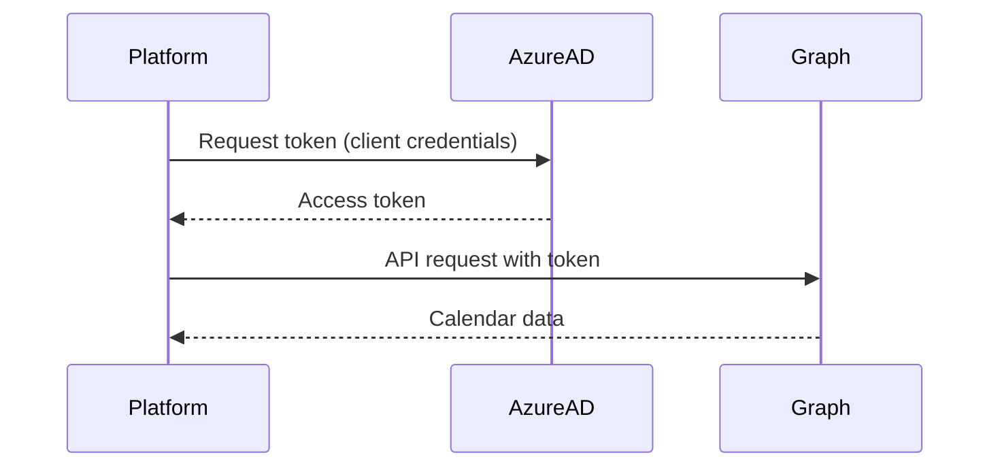
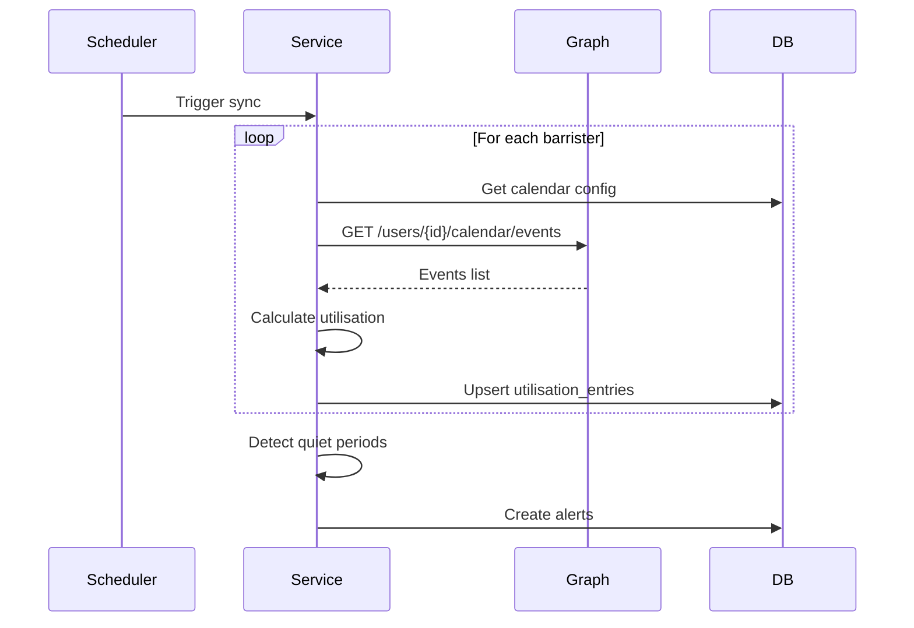

# Microsoft Graph Integration

The Chambers Platform integrates with Microsoft Graph API to sync calendar data for barrister utilisation tracking.

## Overview

The Microsoft Graph integration provides:

- **Calendar Sync** - Import events from Microsoft 365 calendars
- **Utilisation Calculation** - Calculate busy hours and availability
- **Quiet Period Detection** - Identify periods of low utilisation

## Authentication

### OAuth 2.0 Flow

Microsoft Graph uses OAuth 2.0 with client credentials:



### App Registration

The platform uses an Azure AD app registration with:

- **Application (client) ID**
- **Client secret**
- **Tenant ID**

### Required Permissions

| Permission | Type | Purpose |
|------------|------|---------|
| `Calendars.Read` | Application | Read all user calendars |
| `User.Read.All` | Application | Read user profiles |

<Note>
Application permissions allow the platform to read calendars without individual user consent.
</Note>

## Configuration

### Environment Variables

```bash
MS_GRAPH_CLIENT_ID=your_client_id
MS_GRAPH_CLIENT_SECRET=your_client_secret
MS_GRAPH_TENANT_ID=your_tenant_id
```

### Per-Barrister Configuration

Each barrister can have calendar sync configured:

1. Navigate to **Admin** > **Barristers** > **[Barrister]**
2. Configure:
   - **Calendar User ID** - Microsoft 365 user ID or email
   - **Sync Enabled** - Toggle sync on/off
   - **Work Types** - Custom categorization rules

## Calendar Sync

### Sync Process



### Sync Frequency

| Sync Type | Frequency |
|-----------|-----------|
| Incremental | Every 30 minutes |
| Full | Daily at midnight |

### Event Processing

Calendar events are processed to calculate:

```typescript
interface UtilisationEntry {
  barristerId: UUID;
  date: Date;
  hoursBusy: number;
  hoursAvailable: number; // Default: 8
  workType: 'court' | 'preparation' | 'meeting' | 'other';
  isBillable: boolean;
  calendarEventId: string;
}
```

### Work Type Classification

Events are classified based on keywords:

| Work Type | Keywords |
|-----------|----------|
| Court | "court", "hearing", "trial", "sitting" |
| Preparation | "prep", "drafting", "research", "review" |
| Meeting | "meeting", "conference", "call", "client" |
| Other | Default for unclassified events |

### Billable Detection

Events are marked billable if:

- Work type is "court" or "preparation"
- Event title contains client references
- Not marked as "private" or "personal"

## Utilisation Calculation

### Daily Utilisation

```typescript
const utilisation = (hoursBusy / hoursAvailable) * 100;
```

### Standard Working Hours

Default: 8 hours per day (configurable per barrister)

### Quiet Period Detection

A quiet period is detected when:

- Utilisation < 50% for 5+ consecutive working days
- Creates a `quiet_period_alert` for clerk notification

## API Endpoints

### GET /api/utilisation/calendar-sync

Trigger a manual calendar sync.

**Query Parameters:**

| Parameter | Type | Description |
|-----------|------|-------------|
| barristerId | UUID | Sync specific barrister (optional) |
| full | boolean | Full sync vs incremental |

**Response:**
```json
{
  "success": true,
  "synced": 35,
  "errors": 0,
  "details": [
    {
      "barristerId": "uuid",
      "eventsProcessed": 45,
      "utilisationUpdated": true
    }
  ]
}
```

### GET /api/utilisation

Get utilisation data.

**Query Parameters:**

| Parameter | Type | Description |
|-----------|------|-------------|
| barristerId | UUID | Filter by barrister |
| startDate | Date | Period start |
| endDate | Date | Period end |

**Response:**
```json
{
  "data": [
    {
      "date": "2024-01-15",
      "hoursBusy": 6.5,
      "hoursAvailable": 8,
      "utilisation": 81.25,
      "workTypes": {
        "court": 4,
        "preparation": 2,
        "meeting": 0.5
      }
    }
  ]
}
```

### GET /api/utilisation/quiet-periods

Get current quiet period alerts.

**Response:**
```json
{
  "data": [
    {
      "barristerId": "uuid",
      "barristerName": "John Smith KC",
      "periodStart": "2024-01-10",
      "periodEnd": "2024-01-17",
      "averageUtilisation": 35,
      "status": "active"
    }
  ]
}
```

## Error Handling

### Common Errors

| Error | Cause | Solution |
|-------|-------|----------|
| `401 Unauthorized` | Token expired | Refresh token |
| `403 Forbidden` | Missing permissions | Check app permissions |
| `404 Not Found` | User not found | Verify user ID/email |
| `429 Too Many Requests` | Rate limited | Implement backoff |

### Rate Limiting

Microsoft Graph limits:

| Limit | Value |
|-------|-------|
| Per app per tenant | 10,000 requests/10 minutes |

The platform implements:

- Request throttling
- Exponential backoff on 429 errors
- Request batching where possible

## Setup Guide

### Azure AD Configuration

<Steps>
  <Step title="Create App Registration">
    - Go to Azure Portal > Azure Active Directory
    - Click "App registrations" > "New registration"
    - Name: "Chambers Platform Calendar Sync"
    - Supported account types: Single tenant
  </Step>
  <Step title="Configure Permissions">
    - Go to "API permissions"
    - Add Microsoft Graph > Application permissions
    - Add: `Calendars.Read`, `User.Read.All`
    - Grant admin consent
  </Step>
  <Step title="Create Client Secret">
    - Go to "Certificates & secrets"
    - Create new client secret
    - Copy value immediately (shown once)
  </Step>
  <Step title="Note IDs">
    - Application (client) ID
    - Directory (tenant) ID
  </Step>
</Steps>

### Platform Configuration

1. Add environment variables
2. Navigate to Settings > Integrations
3. Verify Microsoft Graph status shows "Connected"
4. Configure calendar sync for each barrister

## Troubleshooting

### Sync Not Working

1. **Check credentials** - Verify client ID, secret, tenant ID
2. **Check permissions** - Ensure app has Calendars.Read permission
3. **Check user ID** - Verify barrister's calendar user ID is correct
4. **Check Graph status** - Microsoft service status

### Missing Events

1. **Check date range** - Sync only fetches future + 30 days past
2. **Check event visibility** - Private events may be excluded
3. **Check calendar** - Ensure events are on primary calendar
4. **Check categorization** - Events may be miscategorized

### Utilisation Discrepancies

1. **Working hours** - Check configured hours (default 8)
2. **All-day events** - May not count correct hours
3. **Overlapping events** - Counted once, not doubled
4. **Timezone** - All times converted to local

## Security Considerations

- **Application Permissions** - No user interaction required
- **Minimal Data** - Only calendar events synced
- **No Content Storage** - Event descriptions not stored
- **Audit Logging** - All sync operations logged
