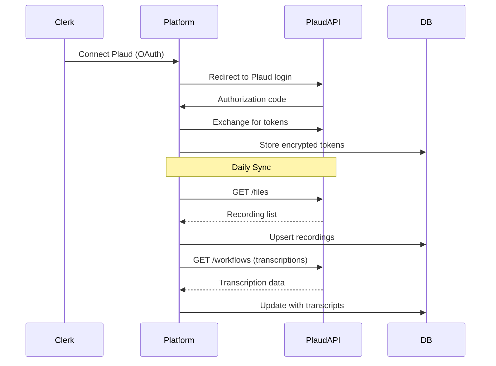

The Chambers Platform integrates with Plaud.ai to capture meeting recordings from Plaud devices, process transcriptions, and extract business intelligence for enhanced lead management and client relationships.

## Overview

The Plaud integration provides:

- **OAuth Authentication** - Secure third-party authorization flow
- **Recording Sync** - Automatic synchronization of meeting recordings
- **Transcription** - AI-powered speech-to-text with speaker identification
- **Entity Linking** - Connect meetings to leads, contacts, and opportunities
- **AI Enhancement** - Meeting context enriches barrister suggestions
- **Content Highlighting** - Shared annotations on meeting content

## Architecture



## Authentication

### OAuth 2.0 Flow

Plaud uses OAuth 2.0 for third-party application authorization:

| Endpoint | URL |
|----------|-----|
| Authorization | `https://app.plaud.ai/platform/oauth` |
| Token Exchange | `https://api.plaud.ai/api/v1/oauth/token` |
| Token Refresh | `https://api.plaud.ai/api/v1/oauth/token` |

### Token Management

| Token Type | Validity | Notes |
|------------|----------|-------|
| Access Token | 24 hours | Auto-refreshed 5 minutes before expiry |
| Refresh Token | 30 days | Stored encrypted (AES-256-GCM) |

### Required Scopes

The integration requests these OAuth scopes:

| Scope | Purpose |
|-------|---------|
| `files.read` | Access recording files |
| `user.read` | Read user profile |
| `workflows.read` | Access transcription results |
| `workflows.write` | Submit transcription jobs |

### Security Measures

- **CSRF Protection** - State token validated on callback (10-minute expiry)
- **Token Encryption** - AES-256-GCM encryption at rest
- **Secure Cookies** - HttpOnly, Secure, SameSite=Lax
- **Basic Auth** - Client credentials via Authorization header

## API Endpoints

### Authentication

#### `GET /api/plaud/auth`

Initiate OAuth flow.

**Query Parameters:**

| Parameter | Type | Description |
|-----------|------|-------------|
| `return_url` | string | URL to redirect after auth (optional) |

**Response:** Redirect to Plaud OAuth page

---

#### `GET /api/plaud/auth/callback`

OAuth callback handler.

**Query Parameters:**

| Parameter | Type | Description |
|-----------|------|-------------|
| `code` | string | Authorization code from Plaud |
| `state` | string | CSRF state token |

**Response:** Redirect to return URL or close popup

---

#### `POST /api/plaud/disconnect`

Revoke Plaud access and deactivate credentials.

**Response:**

```json
{
  "success": true,
  "message": "Plaud integration disconnected"
}
```

---

#### `GET /api/plaud/status`

Check connection status.

**Response:**

```json
{
  "connected": true,
  "plaud_user_id": "usr_xxx",
  "last_sync": "2025-12-25T10:30:00Z",
  "token_expires_at": "2025-12-26T10:30:00Z"
}
```

### Recordings

#### `GET /api/plaud/recordings`

List recordings from local database.

**Query Parameters:**

| Parameter | Type | Default | Description |
|-----------|------|---------|-------------|
| `page` | number | 1 | Page number |
| `page_size` | number | 20 | Results per page |
| `start_date` | string | - | Filter from date (ISO) |
| `end_date` | string | - | Filter to date (ISO) |
| `status` | string | - | Filter by transcription status |
| `linked` | boolean | - | Filter by linked status |

**Response:**

```json
{
  "data": [
    {
      "id": "uuid",
      "plaud_file_id": "file_xxx",
      "title": "Client Meeting - Smith Corp",
      "meeting_date": "2025-12-24T14:00:00Z",
      "duration_seconds": 1845,
      "transcription_status": "completed",
      "lead_id": "uuid",
      "contact_id": null,
      "ai_summary": { ... }
    }
  ],
  "pagination": {
    "page": 1,
    "page_size": 20,
    "total": 45,
    "total_pages": 3
  }
}
```

---

#### `POST /api/plaud/recordings`

Trigger sync from Plaud API.

**Request Body:**

```json
{
  "startDate": "2025-01-01",
  "endDate": "2025-12-31"
}
```

**Response:**

```json
{
  "success": true,
  "processed": 12,
  "succeeded": 11,
  "failed": 1,
  "errors": [
    { "file_id": "file_xxx", "error": "Transcription pending" }
  ]
}
```

### Meeting Content

#### `GET /api/plaud/meetings/[id]/transcribe`

Fetch transcription for a specific meeting.

**Response:**

```json
{
  "success": true,
  "transcription": {
    "text": "Full transcript text...",
    "segments": [...],
    "speakers": [...],
    "language": "en",
    "confidence": 0.95
  }
}
```

---

#### `GET /api/plaud/meetings/[id]/content`

Get processed meeting content including AI-generated summaries.

**Response:**

```json
{
  "success": true,
  "content": {
    "summary": "Meeting summary text...",
    "todo": ["Action item 1", "Action item 2"],
    "client_needs": ["Need 1", "Need 2"],
    "minutes": "Full meeting minutes..."
  }
}
```

---

#### `POST /api/plaud/meetings/[id]/archive`

Archive a meeting recording.

**Response:**

```json
{
  "success": true,
  "message": "Meeting archived"
}
```

### Meeting Highlights

The highlights API allows creating shared annotations on meeting content.

#### `GET /api/plaud/meetings/[id]/highlights`

Fetch all highlights for a meeting.

**Query Parameters:**

| Parameter | Type | Description |
|-----------|------|-------------|
| `contentType` | string | Filter by content type (optional) |

**Response:**

```json
{
  "success": true,
  "highlights": [
    {
      "id": "uuid",
      "contentType": "summary",
      "startOffset": 150,
      "endOffset": 230,
      "highlightedText": "Important client requirement mentioned here",
      "color": "yellow",
      "createdBy": "uuid",
      "createdAt": "2025-12-31T10:30:00Z"
    }
  ]
}
```

---

#### `POST /api/plaud/meetings/[id]/highlights`

Create a new highlight.

**Request Body:**

```json
{
  "contentType": "summary",
  "startOffset": 150,
  "endOffset": 230,
  "highlightedText": "Important client requirement mentioned here",
  "color": "yellow"
}
```

**Content Types:**

| Type | Description |
|------|-------------|
| `summary` | AI-generated meeting summary |
| `todo` | Extracted action items |
| `client_needs` | Identified client requirements |
| `minutes` | Full meeting transcript |

**Highlight Colours:**

| Colour | Hex Code |
|--------|----------|
| `yellow` | #fef08a |
| `green` | #bbf7d0 |
| `blue` | #bfdbfe |
| `pink` | #fbcfe8 |
| `orange` | #fed7aa |

**Response:**

```json
{
  "success": true,
  "highlight": {
    "id": "uuid",
    "contentType": "summary",
    "startOffset": 150,
    "endOffset": 230,
    "highlightedText": "Important client requirement mentioned here",
    "color": "yellow",
    "createdBy": "uuid",
    "createdAt": "2025-12-31T10:30:00Z"
  }
}
```

---

#### `PATCH /api/plaud/meetings/[id]/highlights?highlightId={id}`

Update a highlight colour (owner only).

**Query Parameters:**

| Parameter | Type | Description |
|-----------|------|-------------|
| `highlightId` | uuid | ID of the highlight to update |

**Request Body:**

```json
{
  "color": "green"
}
```

**Response:**

```json
{
  "success": true,
  "highlight": {
    "id": "uuid",
    "color": "green"
  }
}
```

---

#### `DELETE /api/plaud/meetings/[id]/highlights?highlightId={id}`

Delete a highlight (owner only).

**Query Parameters:**

| Parameter | Type | Description |
|-----------|------|-------------|
| `highlightId` | uuid | ID of the highlight to delete |

**Response:**

```json
{
  "success": true
}
```

### Meeting Linking

#### `POST /api/plaud/meetings/[id]/link`

Link a meeting to entities.

**Request Body:**

```json
{
  "type": "lead",
  "entityId": "uuid"
}
```

Or comprehensive linking:

```json
{
  "lead_id": "uuid",
  "contact_id": "uuid",
  "opportunity_id": "uuid"
}
```

**Response:**

```json
{
  "success": true,
  "meeting": {
    "id": "uuid",
    "lead_id": "uuid",
    "contact_id": "uuid"
  }
}
```

---

#### `DELETE /api/plaud/meetings/[id]/link`

Unlink a meeting from entities.

**Request Body:**

```json
{
  "entity_type": "lead"
}
```

Or unlink all:

```json
{
  "entity_type": "all"
}
```

**Response:**

```json
{
  "success": true,
  "message": "Meeting unlinked from lead"
}
```

## Data Model

### Database Tables

#### `plaud_credentials`

Stores encrypted OAuth tokens per user.

| Column | Type | Description |
|--------|------|-------------|
| `id` | uuid | Primary key |
| `user_id` | uuid | Foreign key to users |
| `access_token_encrypted` | text | AES-256-GCM encrypted token |
| `refresh_token_encrypted` | text | AES-256-GCM encrypted token |
| `token_expires_at` | timestamp | Token expiration time |
| `is_active` | boolean | Connection active status |
| `plaud_user_id` | text | Plaud user identifier |

#### `plaud_meetings`

Core meeting storage.

| Column | Type | Description |
|--------|------|-------------|
| `id` | uuid | Primary key |
| `plaud_file_id` | text | Plaud file identifier |
| `user_id` | uuid | Owner user |
| `title` | text | Meeting title |
| `meeting_date` | timestamp | When meeting occurred |
| `duration_seconds` | integer | Recording length |
| `transcription_status` | text | pending, processing, completed, failed |
| `transcription_text` | text | Full transcript text |
| `transcription_data` | jsonb | Structured transcript with speakers |
| `ai_summary` | jsonb | AI-generated summary |
| `ai_insights` | jsonb | Extracted intelligence |
| `lead_id` | uuid | Linked lead (nullable) |
| `contact_id` | uuid | Linked contact (nullable) |
| `opportunity_id` | uuid | Linked opportunity (nullable) |

#### `meeting_content_highlights`

Shared text highlights on meeting content.

| Column | Type | Description |
|--------|------|-------------|
| `id` | uuid | Primary key |
| `meeting_id` | uuid | Foreign key to plaud_meetings |
| `content_type` | text | summary, todo, client_needs, minutes |
| `start_offset` | integer | Character start position |
| `end_offset` | integer | Character end position |
| `highlighted_text` | text | The highlighted text content |
| `color` | text | yellow, green, blue, pink, orange |
| `created_by` | uuid | Foreign key to users |
| `created_at` | timestamp | When highlight was created |

**RLS Policies:**

- All clerks can read all highlights
- Only the creator can update/delete their highlights
- Management has full access

#### `plaud_sync_log`

Sync operation audit trail.

| Column | Type | Description |
|--------|------|-------------|
| `id` | uuid | Primary key |
| `user_id` | uuid | User who triggered sync |
| `sync_type` | text | recordings, transcriptions |
| `status` | text | started, completed, failed |
| `records_processed` | integer | Total records handled |
| `records_succeeded` | integer | Successful operations |
| `records_failed` | integer | Failed operations |
| `duration_ms` | integer | Sync duration |

### TypeScript Types

Key types from `src/lib/types/plaud.types.ts`:

```typescript
interface PlaudRecording {
  file_id: string;
  title: string;
  created_at: string;
  duration_seconds: number;
  file_size: number;
  file_url: string;
  transcription_status: 'pending' | 'processing' | 'completed' | 'failed';
}

interface PlaudTranscription {
  text: string;
  segments: PlaudTranscriptSegment[];
  speakers: PlaudSpeaker[];
  language: string;
  confidence: number;
}

interface PlaudMeetingInsights {
  practice_areas: string[];
  urgency_level: 'low' | 'medium' | 'high';
  action_items: PlaudActionItem[];
  key_topics: string[];
  sentiment: 'positive' | 'neutral' | 'negative';
  lead_signals: PlaudLeadSignal[];
}

interface MeetingContentHighlight {
  id: string;
  meetingId: string;
  contentType: 'summary' | 'todo' | 'client_needs' | 'minutes';
  startOffset: number;
  endOffset: number;
  highlightedText: string;
  color: 'yellow' | 'green' | 'blue' | 'pink' | 'orange';
  createdBy: string;
  createdAt: string;
}
```

## Resilience Patterns

### Rate Limiting

The service implements client-side rate limiting:

```typescript
class RateLimiter {
  limit: 10;          // requests per window
  windowMs: 60000;    // 1 minute window
}
```

When rate limited, throws `PlaudRateLimitError` with retry-after value.

### Circuit Breaker

Prevents cascading failures:

| State | Description |
|-------|-------------|
| CLOSED | Normal operation, requests pass through |
| OPEN | Too many failures, requests blocked for 60s |
| HALF_OPEN | Test request allowed after recovery timeout |

Configuration:
- Failure threshold: 5 consecutive failures
- Recovery timeout: 60 seconds

### Error Handling

Error types and recovery:

| Error Type | Retryable | Action |
|------------|-----------|--------|
| `auth` | No | Re-authenticate via OAuth |
| `rate_limit` | Yes | Wait for retry-after seconds |
| `network` | Yes | Retry with exponential backoff |
| `validation` | No | Fix request parameters |

## Integration with AI

Meeting data enhances AI features:

### Lead Suggestions

When a meeting is linked to a lead, the AI suggestion engine considers:
- Practice areas discussed in the meeting
- Urgency indicators from conversation
- Client preferences mentioned
- Historical meeting patterns

### Privacy Filtering

Before sending to AI:
- Client names are tokenized
- Specific financial amounts are bucketed
- Personal identifiers are removed
- Only relevant excerpts are included

## Environment Variables

```bash
# Required for OAuth
PLAUD_CLIENT_ID=your_client_id
PLAUD_CLIENT_SECRET=your_client_secret
PLAUD_OAUTH_REDIRECT_URI=https://chambers-platform.vercel.app/api/plaud/auth/callback

# Optional
PLAUD_API_BASE_URL=https://api.plaud.ai  # defaults to this
```

## Service Files

| File | Purpose |
|------|---------|
| `src/lib/services/plaud-api.service.ts` | API client with rate limiting |
| `src/lib/services/plaud-auth.service.ts` | OAuth and token management |
| `src/lib/types/plaud.types.ts` | TypeScript type definitions |
| `src/routes/api/plaud/*` | API route handlers |

## Audit Events

The following events are logged to `audit_log`:

| Event | Description |
|-------|-------------|
| `plaud.auth_completed` | OAuth flow completed successfully |
| `plaud.auth_revoked` | User disconnected Plaud |
| `plaud.token_refreshed` | Access token was refreshed |
| `plaud.sync_started` | Recording sync initiated |
| `plaud.sync_completed` | Recording sync finished |
| `plaud.meeting_linked` | Meeting linked to entity |
| `plaud.meeting_unlinked` | Meeting unlinked from entity |
| `plaud.highlight_created` | Highlight added to meeting content |
| `plaud.highlight_deleted` | Highlight removed from meeting content |

## Troubleshooting

### OAuth Failures

1. Verify `PLAUD_CLIENT_ID` and `PLAUD_CLIENT_SECRET` are correct
2. Check redirect URI matches exactly in Plaud developer settings
3. Ensure state token hasn't expired (10-minute window)

### Sync Issues

1. Check circuit breaker state isn't OPEN
2. Verify rate limit hasn't been exceeded
3. Check Plaud API status at status.plaud.ai
4. Review `plaud_sync_log` for error details

### Token Refresh Failures

1. Refresh token may have expired (30 days)
2. User needs to re-authenticate via OAuth
3. Check encryption key hasn't changed

### Highlights Not Saving

1. Verify the meeting exists in the database
2. Check user has clerk or management role
3. Ensure content type is valid (summary, todo, client_needs, minutes)
4. Verify offsets are valid (endOffset > startOffset)
