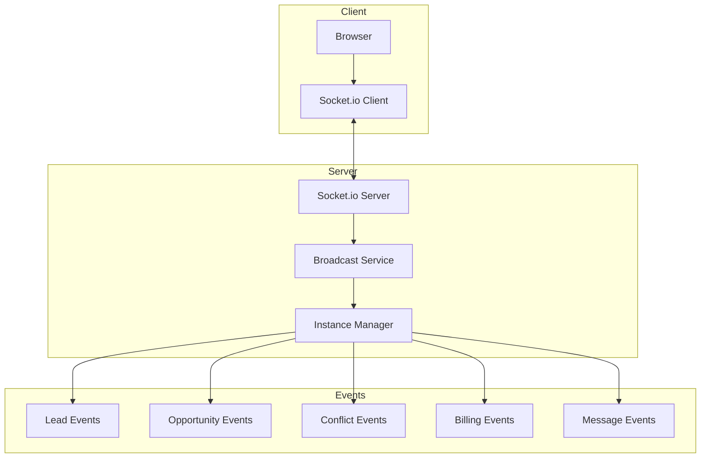

The Chambers Platform uses Socket.io for real-time bidirectional communication, enabling instant updates for lead assignments, opportunity changes, conflict alerts, billing time entries, and messaging broadcasts.

## Overview

| Feature | Details |
|---------|---------|
| **Library** | Socket.io |
| **Transport** | WebSocket with HTTP long-polling fallback |
| **Direction** | Bidirectional |
| **Purpose** | Live updates, notifications, conflict resolution |

## Package Version

| Package | Version |
|---------|---------|
| `socket.io` | 4.7.x |
| `socket.io-client` | 4.7.x |

## Architecture



## Service Files

| File | Purpose |
|------|---------|
| `socket.client.ts` | Client-side Socket.io connection |
| `socket.server.ts` | Server-side Socket.io setup |
| `broadcast.server.ts` | Event broadcasting utilities |
| `socket-instance.server.ts` | Socket instance management |

## Event Types

### Lead Events

| Event | Direction | Description |
|-------|-----------|-------------|
| `lead:created` | Server → Client | New lead created |
| `lead:assigned` | Server → Client | Lead assigned to barrister |
| `lead:accepted` | Server → Client | Barrister accepted lead |
| `lead:rejected` | Server → Client | Barrister rejected lead |
| `lead:updated` | Server → Client | Lead details updated |

### Opportunity Events

| Event | Direction | Description |
|-------|-----------|-------------|
| `opportunity:created` | Server → Client | New opportunity created |
| `opportunity:updated` | Server → Client | Opportunity details changed |
| `opportunity:closed` | Server → Client | Opportunity closed |
| `opportunity:participant:added` | Server → Client | Barrister added to opportunity |

### Conflict Events

| Event | Direction | Description |
|-------|-----------|-------------|
| `conflict:detected` | Server → Client | Multiple acceptances detected |
| `conflict:resolved` | Server → Client | Conflict resolved by clerk |

### Time Entry Events

| Event | Direction | Description |
|-------|-----------|-------------|
| `billing:entry:submitted` | Server → Client | Barrister submitted time entry |
| `billing:entry:approved` | Server → Client | Clerk approved time entry |
| `billing:entry:invoiced` | Server → Client | Entry included on invoice |

### Messaging Hub Events

| Event | Direction | Description |
|-------|-----------|-------------|
| `message:broadcast` | Server → Client | Chambers-wide message sent |
| `message:poll:vote` | Server → Client | Poll vote received |
| `message:read` | Client → Server | Message marked as read |

### System Events

| Event | Direction | Description |
|-------|-----------|-------------|
| `connect` | Bidirectional | Connection established |
| `disconnect` | Bidirectional | Connection lost |
| `reconnect` | Client → Server | Reconnection attempt |

## Client Implementation

### Connection Setup

```typescript
// socket.client.ts
import { io, Socket } from 'socket.io-client';

let socket: Socket | null = null;

export function initializeSocket(userId: string, role: string) {
  socket = io({
    auth: {
      userId,
      role
    },
    reconnection: true,
    reconnectionDelay: 1000,
    reconnectionAttempts: 5
  });

  socket.on('connect', () => {
    console.log('Socket connected:', socket?.id);
  });

  socket.on('disconnect', (reason) => {
    console.log('Socket disconnected:', reason);
  });

  return socket;
}
```

### Listening for Events

```typescript
import { getSocket } from '$lib/websocket/socket.client';

const socket = getSocket();

// Listen for lead updates
socket?.on('lead:assigned', (data) => {
  console.log('Lead assigned:', data.leadId, 'to', data.barristerId);
  // Update UI
});

// Listen for conflicts
socket?.on('conflict:detected', (data) => {
  console.log('Conflict on lead:', data.leadId);
  // Show conflict resolution UI
});
```

### Cleanup

```typescript
import { onDestroy } from 'svelte';
import { disconnectSocket } from '$lib/websocket/socket.client';

onDestroy(() => {
  disconnectSocket();
});
```

## Server Implementation

### Socket Server Setup

```typescript
// socket.server.ts
import { Server } from 'socket.io';

export function createSocketServer(httpServer: any) {
  const io = new Server(httpServer, {
    cors: {
      origin: process.env.PUBLIC_APP_URL,
      credentials: true
    }
  });

  io.on('connection', (socket) => {
    const { userId, role } = socket.handshake.auth;

    // Join role-based rooms
    socket.join(`role:${role}`);
    socket.join(`user:${userId}`);

    console.log(`User ${userId} connected with role ${role}`);
  });

  return io;
}
```

### Broadcasting Events

```typescript
// broadcast.server.ts
import { getSocketInstance } from './socket-instance.server';

export function broadcastLeadAssigned(leadId: string, barristerId: string) {
  const io = getSocketInstance();

  // Broadcast to all clerks
  io.to('role:clerk').emit('lead:assigned', {
    leadId,
    barristerId,
    timestamp: new Date().toISOString()
  });

  // Notify specific barrister
  io.to(`user:${barristerId}`).emit('lead:assigned', {
    leadId,
    barristerId,
    timestamp: new Date().toISOString()
  });
}

export function broadcastConflict(leadId: string, acceptedBy: string[]) {
  const io = getSocketInstance();

  // Broadcast to clerks and involved barristers
  io.to('role:clerk').emit('conflict:detected', {
    leadId,
    acceptedBy,
    timestamp: new Date().toISOString()
  });
}
```

## Room-Based Broadcasting

### Room Types

| Room Pattern | Purpose |
|--------------|---------|
| `role:{role}` | All users with specific role |
| `user:{userId}` | Specific user |
| `lead:{leadId}` | Users watching a specific lead |
| `opportunity:{opportunityId}` | Users watching opportunity |

### Joining Rooms

```typescript
// Server-side room management
socket.on('watch:lead', (leadId: string) => {
  socket.join(`lead:${leadId}`);
});

socket.on('unwatch:lead', (leadId: string) => {
  socket.leave(`lead:${leadId}`);
});
```

## API Endpoint

### GET /api/socket

Socket.io handshake endpoint.

**Authentication:** Required (session-based)

**Headers:**
```
Upgrade: websocket
Connection: Upgrade
```

## Error Handling

### Connection Errors

```typescript
socket.on('connect_error', (error) => {
  if (error.message === 'unauthorized') {
    // Redirect to login
    goto('/auth/login');
  } else {
    // Show retry message
    console.error('Connection failed:', error.message);
  }
});
```

### Reconnection Strategy

```typescript
const socket = io({
  reconnection: true,
  reconnectionDelay: 1000,      // Start with 1s
  reconnectionDelayMax: 5000,   // Max 5s between attempts
  reconnectionAttempts: 5       // Try 5 times then give up
});

socket.on('reconnect', (attemptNumber) => {
  console.log('Reconnected after', attemptNumber, 'attempts');
});

socket.on('reconnect_failed', () => {
  console.error('Failed to reconnect after all attempts');
  // Show manual reconnect button
});
```

## Security

### Authentication

- Socket connections require valid session
- User ID and role extracted from auth token
- Unauthorized connections rejected

### Authorization

- Room membership based on role
- Clerks receive all lead events
- Barristers only receive their own events
- Management receives summary events

### Rate Limiting

```typescript
// Server-side rate limiting
const rateLimiter = new Map<string, number>();

socket.use((packet, next) => {
  const userId = socket.handshake.auth.userId;
  const count = rateLimiter.get(userId) || 0;

  if (count > 100) { // 100 events per minute
    return next(new Error('Rate limited'));
  }

  rateLimiter.set(userId, count + 1);
  next();
});
```

## Performance

### Message Compression

Socket.io uses perMessageDeflate for WebSocket compression by default.

### Connection Pooling

- Single connection per client
- Multiplexed namespaces for different features
- Efficient binary message encoding

### Heartbeat

```typescript
const io = new Server(httpServer, {
  pingTimeout: 60000,    // 60s timeout
  pingInterval: 25000    // Ping every 25s
});
```

## Troubleshooting

### Connection Issues

1. **Check CORS settings** - Verify origin is allowed
2. **Check authentication** - Ensure session is valid
3. **Check firewall** - WebSocket port must be open
4. **Check proxy** - Nginx must support WebSocket upgrade

### Events Not Received

1. **Check room membership** - User must be in correct room
2. **Check event name** - Case-sensitive matching
3. **Check server logs** - Verify event was emitted
4. **Check client subscription** - Listener must be registered

### Memory Leaks

1. **Clean up listeners** - Use `socket.off()` or `onDestroy`
2. **Leave rooms** - When navigating away
3. **Disconnect properly** - On logout or page unload

## Monitoring

### Connection Metrics

Monitor at `/admin/settings`:

- Active connections count
- Events per minute
- Connection errors
- Reconnection rate

### Logging

```typescript
// Enable debug logging
localStorage.debug = 'socket.io-client:socket';
```
