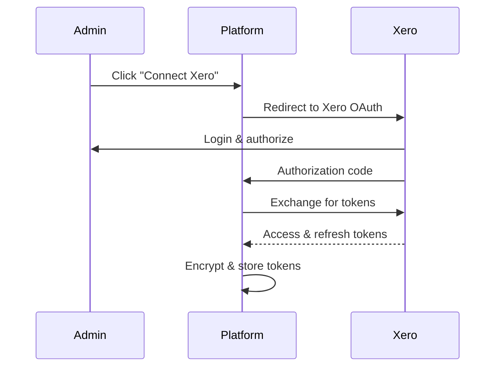
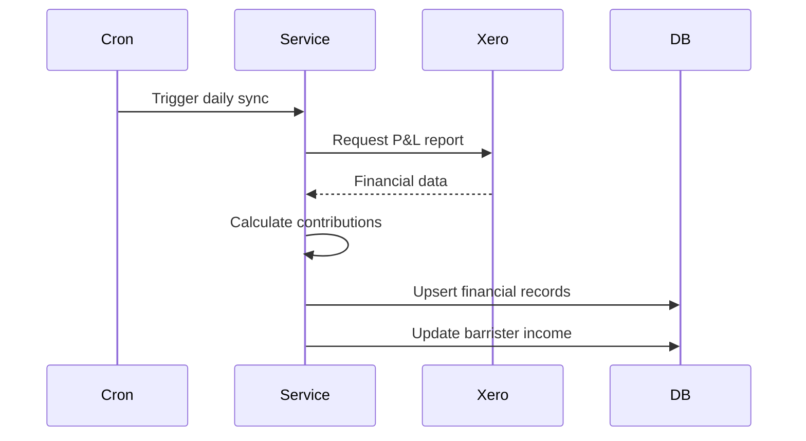

The Chambers Platform integrates with Xero for financial data synchronization, enabling income tracking, contribution calculations, and financial reporting.

## Overview

The Xero integration provides:

- **Income Tracking** - Gross income per barrister
- **Contribution Calculation** - Chambers contribution tiers
- **Aged Debt** - Outstanding invoice tracking
- **Expense Tracking** - Chambers expenses
- **Target Monitoring** - Progress toward annual targets

## Authentication

### OAuth 2.0 Flow

Xero uses OAuth 2.0 with PKCE for authentication:



### Token Management

| Token Type | Validity | Notes |
|------------|----------|-------|
| Access Token | 30 minutes | Auto-refreshed before expiry |
| Refresh Token | 60 days | Requires re-authentication if expired |

Tokens are encrypted at rest using AES-256.

### Required Scopes

| Scope | Purpose |
|-------|---------|
| `accounting.reports.read` | Read financial reports |
| `accounting.transactions.read` | Read invoices and payments |
| `accounting.contacts.read` | Read contact information |
| `accounting.settings.read` | Read account settings |

## Data Synchronization

### Sync Types

| Sync Type | Data | Frequency |
|-----------|------|-----------|
| Profit & Loss | Income per barrister | Daily (2am) |
| Balance Sheet | Assets, liabilities | Weekly |
| Aged Receivables | Outstanding invoices | Daily |
| Bank Transactions | Expense tracking | Daily |

### Sync Process



## Financial Data

### Income Tracking

Income is extracted from Xero reports:

```typescript
interface FinancialRecord {
  barristerId: UUID;
  periodStart: Date;
  periodEnd: Date;
  grossIncome: number;
  chambersContribution: number;
  tier: '14%' | '7%' | '3%' | '1%';
  paymentStatus: 'pending' | 'paid' | 'overdue';
}
```

### Contribution Tiers

Chambers contribution is calculated using tiered rates:

| Income Threshold | Rate | Description |
|-----------------|------|-------------|
| £0 - £500,000 | 14% | Standard rate |
| £500,001 - £750,000 | 7% | Reduced rate |
| £750,001 - £1,000,000 | 3% | Further reduced |
| Over £1,000,000 | 1% | Minimum rate |

**Example calculation for £800,000 income:**

- First £500,000 × 14% = £70,000
- Next £250,000 × 7% = £17,500
- Next £50,000 × 3% = £1,500
- **Total Contribution**: £89,000

### Aged Debt

Outstanding invoices are tracked:

```typescript
interface AgedDebtEntry {
  barristerId: UUID;
  invoiceNumber: string;
  clientName: string;
  amount: number;
  dueDate: Date;
  daysOverdue: number;
  agingBucket: 'current' | '30' | '60' | '90' | '90+';
}
```

## API Endpoints

### GET /api/financial/xero/status

Check Xero connection status.

**Response:**
```json
{
  "connected": true,
  "organisation": "Chambers LLP",
  "lastSync": "2024-01-15T02:00:00Z",
  "tokenExpiresAt": "2024-01-15T12:30:00Z"
}
```

### POST /api/financial/xero/sync

Trigger a manual sync.

**Request:**
```json
{
  "type": "full",
  "reports": ["profit_loss", "aged_receivables"]
}
```

### GET /api/financial/xero/mappings

Get barrister-to-contact mappings.

**Response:**
```json
{
  "data": [
    {
      "barristerId": "uuid",
      "barristerName": "John Smith KC",
      "xeroContactId": "xero-uuid",
      "xeroContactName": "J Smith",
      "status": "mapped"
    }
  ]
}
```

### PUT /api/financial/xero/mappings/:barristerId

Update a mapping.

**Request:**
```json
{
  "xeroContactId": "xero-uuid"
}
```

## Error Handling

### Common Errors

| Error | Cause | Solution |
|-------|-------|----------|
| `token_expired` | Refresh token expired | Reconnect Xero |
| `rate_limited` | Too many requests | Wait and retry |
| `not_found` | Contact not in Xero | Verify mapping |
| `unauthorized` | Permissions revoked | Reconnect with correct scopes |

### Circuit Breaker

Xero API calls use a circuit breaker:

- Opens after 5 consecutive failures
- Half-open after 30 seconds
- Prevents cascading failures

### Rate Limiting

| Limit | Value |
|-------|-------|
| Per minute | 60 requests |
| Per day | 5,000 requests |

The platform respects these limits with request throttling.

## Configuration

### Environment Variables

```bash
XERO_CLIENT_ID=your_client_id
XERO_CLIENT_SECRET=your_client_secret
XERO_REDIRECT_URI=https://your-domain.com/api/financial/xero/auth/callback
```

### Webhook Configuration (Optional)

For real-time updates, configure Xero webhooks:

1. In Xero developer portal, add webhook URL
2. Configure events: `INVOICE.UPDATE`, `PAYMENT.CREATE`
3. Platform validates and processes events

## Troubleshooting

### Connection Issues

1. **Check token status** in Settings > Integrations
2. **Verify organisation** is still accessible
3. **Reconnect** if tokens have expired
4. **Check Xero status** for service outages

### Sync Failures

1. **Review sync logs** for error details
2. **Check mappings** - all barristers should be mapped
3. **Verify data** exists in Xero for the sync period
4. **Retry sync** after fixing issues

### Data Discrepancies

1. **Compare dates** - ensure same reporting period
2. **Check mappings** - verify correct contact links
3. **Review Xero reports** directly
4. **Contact support** if discrepancies persist

## Security Considerations

- **Encryption**: All tokens encrypted at rest
- **Minimal Scope**: Only read permissions requested
- **Audit Trail**: All sync operations logged
- **No PII Storage**: Only aggregate financial data stored
