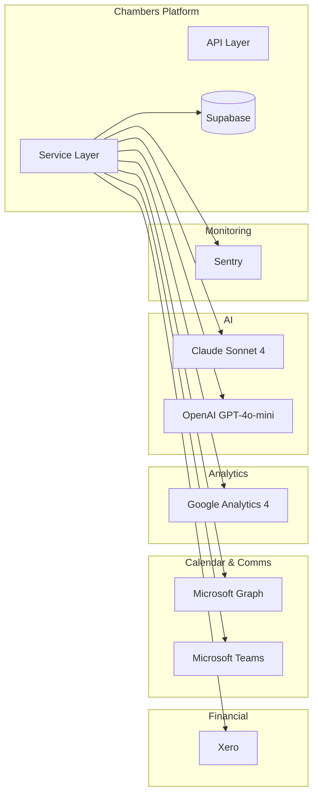

# Developer Documentation

Technical documentation for developers working with the Chambers Platform integrations and architecture.

## Integration Overview

The Chambers Platform integrates with several external services:



## Available Integrations

| Integration | Purpose | Auth Method | Sync Direction |
|-------------|---------|-------------|----------------|
| [Xero](/developers/integrations/xero) | Financial data, Invoices | OAuth 2.0 | One-way (from Xero) |
| [Microsoft Graph](/developers/integrations/microsoft-graph) | Calendar, Availability | OAuth 2.0 | One-way (from M365) |
| [Microsoft Teams](/developers/integrations/microsoft-teams) | Notifications, Alerts | Webhook | Outbound |
| [Google Analytics](/developers/integrations/google-analytics) | Website analytics | Service Account | One-way (from GA) |
| [AI (Claude & OpenAI)](/developers/integrations/ai) | AI insights, Suggestions | API Keys | Request/Response |
| [Sentry](/developers/integrations/sentry) | Error monitoring | DSN | Outbound |

## Common Patterns

### Circuit Breaker

All integrations use circuit breakers to handle failures gracefully:

```typescript
const circuitBreaker = new CircuitBreaker({
  failureThreshold: 5,    // Open after 5 failures
  resetTimeout: 30000,    // Try again after 30 seconds
  halfOpenRequests: 3     // Allow 3 test requests
});
```

### Rate Limiting

Each integration respects API rate limits:

| Service | Rate Limit |
|---------|------------|
| Xero | 60 req/min, 5000 req/day |
| Microsoft Graph | 10,000 req/10 min |
| OpenAI | Varies by tier |
| Google Analytics | 50,000 req/day |

### Error Handling

Integrations implement graceful degradation:

1. **Retry with backoff** - Temporary failures retry automatically
2. **Circuit breaker** - Repeated failures stop requests temporarily
3. **Fallback data** - Cached data used when service unavailable
4. **User notification** - Dashboard shows integration status

## Environment Variables

```bash
# Xero
XERO_CLIENT_ID=your_client_id
XERO_CLIENT_SECRET=your_client_secret

# Microsoft Graph
MS_GRAPH_CLIENT_ID=your_client_id
MS_GRAPH_CLIENT_SECRET=your_client_secret
MS_GRAPH_TENANT_ID=your_tenant_id

# Google Analytics
GA_PROPERTY_ID=your_property_id
GOOGLE_APPLICATION_CREDENTIALS=path_to_credentials.json

# AI (Hybrid Architecture)
ANTHROPIC_API_KEY=your_anthropic_key  # For Chamber Insights
OPENAI_API_KEY=your_openai_key        # For Lead Suggestions
```

## Integration Status

Check integration health at `/admin/settings`:

- **Connected**: Integration is active and syncing
- **Disconnected**: Needs authentication
- **Error**: Integration has issues (check logs)
- **Rate Limited**: Temporarily paused due to API limits

## Sync Operations

### Manual Sync

Administrators can trigger manual syncs from `/admin/settings`:

- **Full Sync** - Complete data refresh
- **Incremental Sync** - Only changed records
- **Entity Sync** - Specific entity type only

### Scheduled Sync

Automatic syncs run on schedule:

| Integration | Schedule | Type |
|-------------|----------|------|
| Xero | Daily at 2am | Full |
| Calendar | Every 30 minutes | Incremental |
| Analytics | Daily at 3am | Full |
