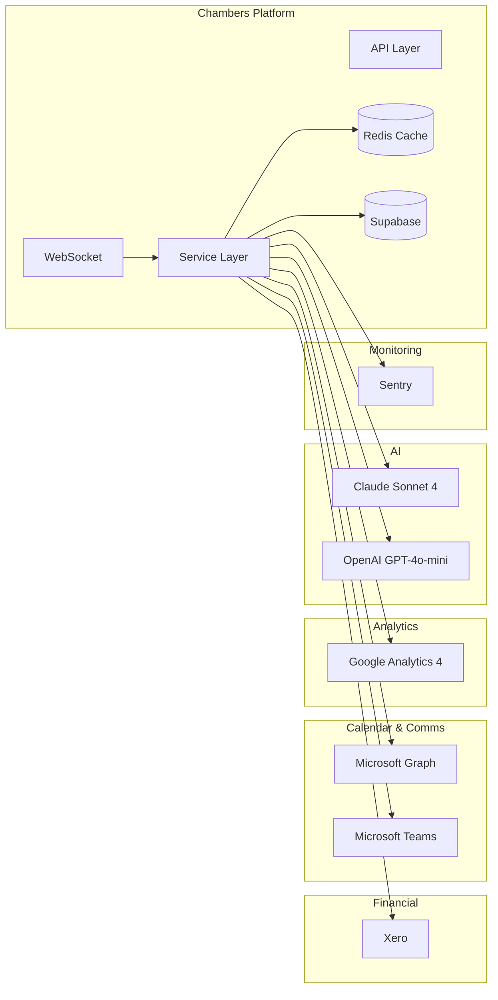

Technical documentation for developers working with the Chambers Platform integrations and architecture.

## Integration Overview

The Chambers Platform integrates with several external services:



## Available Integrations

| Integration | Purpose | Auth Method | Sync Direction |
|-------------|---------|-------------|----------------|
| [Xero](/developers/integrations/xero) | Financial data, Invoices | OAuth 2.0 | One-way (from Xero) |
| [Microsoft Graph](/developers/integrations/microsoft-graph) | Calendar, Availability | OAuth 2.0 | One-way (from M365) |
| [Microsoft Teams](/developers/integrations/microsoft-teams) | Notifications, Alerts | Webhook | Outbound |
| [Google Analytics](/developers/integrations/google-analytics) | Website analytics | Service Account | One-way (from GA) |
| [AI (Claude & OpenAI)](/developers/integrations/ai) | AI insights, Suggestions | API Keys | Request/Response |
| [Sentry](/developers/integrations/sentry) | Error monitoring | DSN | Outbound |
| [Real-time (Socket.io)](/developers/integrations/realtime) | Live updates | WebSocket | Bidirectional |
| [Caching (Redis)](/developers/integrations/caching) | Performance | REST API | Internal |

## Package Versions

Key integration packages used in the platform:

| Package | Version | Integration |
|---------|---------|-------------|
| `xero-node` | 13.3.0 | Xero |
| `@microsoft/microsoft-graph-client` | 3.x | Microsoft Graph |
| `@anthropic-ai/sdk` | 0.71.0 | Claude AI |
| `openai` | 4.24.7 | OpenAI |
| `@sentry/sveltekit` | 10.30.0 | Sentry |
| `@google-analytics/data` | 4.2.0 | Google Analytics |
| `socket.io` | 4.7.x | Real-time |
| `@upstash/redis` | 1.x | Redis caching |
| `@upstash/ratelimit` | 1.x | Rate limiting |

## Common Patterns

### Circuit Breaker

All integrations use circuit breakers to handle failures gracefully:

```typescript
const circuitBreaker = new CircuitBreaker({
  failureThreshold: 5,    // Open after 5 failures
  resetTimeout: 30000,    // Try again after 30 seconds
  halfOpenRequests: 3     // Allow 3 test requests
});
```

### Rate Limiting

Each integration respects API rate limits:

| Service | Rate Limit |
|---------|------------|
| Xero | 60 req/min, 5000 req/day |
| Microsoft Graph | 10,000 req/10 min |
| OpenAI | Varies by tier |
| Claude | Varies by tier |
| Google Analytics | 50,000 req/day |
| Internal API | 1000 req/min per user |

### Error Handling

Integrations implement graceful degradation:

1. **Retry with backoff** - Temporary failures retry automatically
2. **Circuit breaker** - Repeated failures stop requests temporarily
3. **Fallback data** - Cached data used when service unavailable
4. **User notification** - Dashboard shows integration status

## Environment Variables

```bash
# Xero
XERO_CLIENT_ID=your_client_id
XERO_CLIENT_SECRET=your_client_secret
XERO_REDIRECT_URI=your_redirect_uri

# Microsoft Graph
MS_GRAPH_CLIENT_ID=your_client_id
MS_GRAPH_CLIENT_SECRET=your_client_secret
MS_GRAPH_TENANT_ID=your_tenant_id

# Microsoft Teams (optional)
TEAMS_WEBHOOK_URL=your_webhook_url
TEAMS_NOTIFICATIONS_ENABLED=true

# Google Analytics
GA_PROPERTY_ID=your_property_id
GA_SERVICE_ACCOUNT_EMAIL=your_email
GA_PRIVATE_KEY=your_private_key
GA_PROJECT_ID=your_project_id

# AI (Hybrid Architecture)
ANTHROPIC_API_KEY=your_anthropic_key  # For Chamber Insights
OPENAI_API_KEY=your_openai_key        # For Lead Suggestions

# Sentry
SENTRY_DSN=your_dsn
VITE_SENTRY_DSN=your_public_dsn

# Redis (Upstash)
UPSTASH_REDIS_REST_URL=your_url
UPSTASH_REDIS_REST_TOKEN=your_token
```

## Integration Status

Check integration health at `/admin/settings`:

- **Connected**: Integration is active and syncing
- **Disconnected**: Needs authentication
- **Error**: Integration has issues (check logs)
- **Rate Limited**: Temporarily paused due to API limits

## Sync Operations

### Manual Sync

Administrators can trigger manual syncs from `/admin/settings`:

- **Full Sync** - Complete data refresh
- **Incremental Sync** - Only changed records
- **Entity Sync** - Specific entity type only

### Scheduled Sync

Automatic syncs run on schedule:

| Integration | Schedule | Type |
|-------------|----------|------|
| Xero | Daily at 2am | Full |
| Calendar | Every 30 minutes | Incremental |
| Analytics | Daily at 3am | Full |

## API Endpoints Summary

### AI Endpoints

| Endpoint | Method | Provider |
|----------|--------|----------|
| `/api/ai/chambers-insights` | GET | Claude |
| `/api/ai/suggestions` | POST | OpenAI |
| `/api/ai/analytics-insights` | POST | OpenAI |
| `/api/ai/client-insights` | POST | OpenAI |
| `/api/ai/opportunities/suggestions` | POST | OpenAI |

### Financial Endpoints

| Endpoint | Method | Integration |
|----------|--------|-------------|
| `/api/financial/xero/status` | GET | Xero |
| `/api/financial/xero/sync` | POST | Xero |
| `/api/financial/xero/mappings` | GET/PUT | Xero |

### Real-time

| Endpoint | Protocol | Purpose |
|----------|----------|---------|
| `/api/socket` | WebSocket | Real-time events |

## Security Considerations

All integrations follow security best practices:

- **Encryption**: Tokens encrypted at rest (AES-256)
- **Minimal Scope**: Only required permissions requested
- **Audit Trail**: All operations logged
- **PII Protection**: Data anonymized before AI calls
- **GDPR Compliance**: Data handling meets regulations
