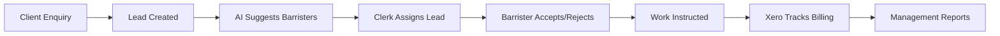

This guide explains how the Chambers Platform works and what you'll experience when you first log in. For role-specific features, see the [Barrister](/barrister/quick-start), [Clerk](/clerk/quick-start), or [Management](/management/quick-start) guides.

## How the Platform Works

The Chambers Platform connects three key workflows:

**Clerks** create and assign leads. **Barristers** respond and complete work. **Management** monitors performance. All data flows automatically through the system.

## Your First Login

### What You'll See

When you first log in, you'll land on your role-specific dashboard:

| Role | Dashboard Shows |
|------|-----------------|
| **Barrister** | Pending leads to respond to, your performance metrics, upcoming opportunities |
| **Clerk** | Unassigned leads, leads awaiting response, barrister availability overview |
| **Management** | Executive KPIs, financial summary, AI-generated insights |

### First-Time Setup Checklist

<Steps>
  <Step title="Verify your profile information">
    Click your name in the header → **Profile**. Confirm your practice areas, seniority level, and contact details are correct. This data is used for AI-powered lead suggestions.
  </Step>
  <Step title="Check your notification preferences">
    Navigate to **Settings → Notifications**. Choose whether to receive email alerts for new lead assignments, opportunity invitations, and system updates.
  </Step>
  <Step title="Review pending items">
    Your dashboard highlights items needing attention with red badges or alert icons. Start by addressing any pending actions.
  </Step>
  <Step title="Explore the sidebar navigation">
    The left sidebar organises features by category. Hover over icons to see labels, or pin the sidebar open for full navigation.
  </Step>
</Steps>

## Understanding the Interface

### Navigation Structure

- **Header** - Your profile, role switcher (if multi-role), notifications bell, and global search
- **Sidebar** - Main navigation organised by feature area (Leads, Opportunities, Reports, etc.)
- **Main Content** - The active page with data tables, forms, or dashboards
- **Quick Actions** - Floating action buttons for common tasks like "New Lead"

### Key Interface Patterns

| Element | What It Means |
|---------|---------------|
| Red badge with number | Items requiring your attention |
| Green status pill | Active/healthy status |
| Orange/amber pill | Warning or pending state |
| Sparkline charts | Trend over time (hover for values) |
| Three-dot menu (⋮) | Additional actions for that item |

## Multi-Role Users

Some users have multiple roles (e.g., a barrister who also serves as a door tenant manager).

**To switch roles:**
1. Click your name in the header
2. Select **Switch Role**
3. Choose your desired role from the dropdown
4. Your dashboard and navigation will update accordingly

<Tip>
Your current role appears below your name in the header. Each role has its own dashboard and permissions.
</Tip>

## Getting Help

- **Contextual Help** - Press **Shift + ?** on any page to see available keyboard shortcuts and page-specific guidance
- **Search** - Use the global search (magnifying glass icon or **Cmd/Ctrl + K**) to find leads, clients, or barristers
- **Support** - Email [support@33cllaw.com](mailto:support@33cllaw.com) for technical issues

<Card title="Next: First-Time Login" icon="arrow-right" href="/getting-started/first-login">
  Step-by-step login instructions
</Card>
